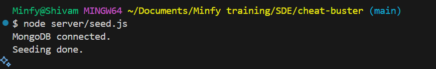
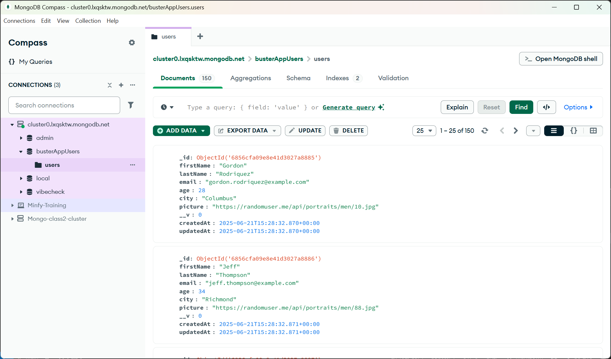
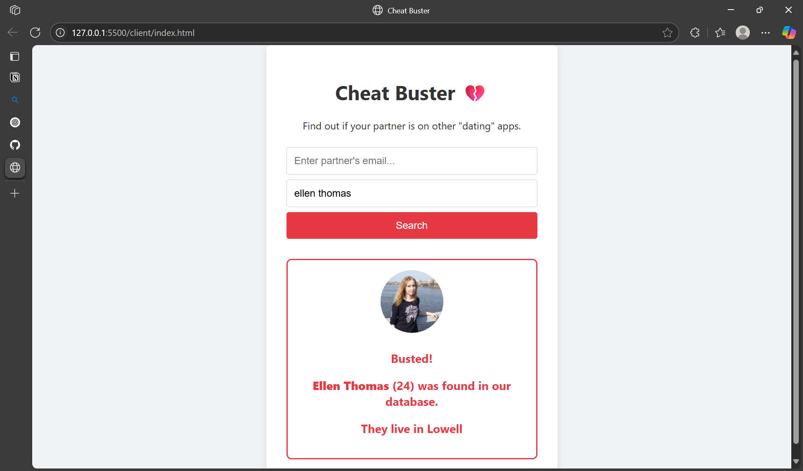
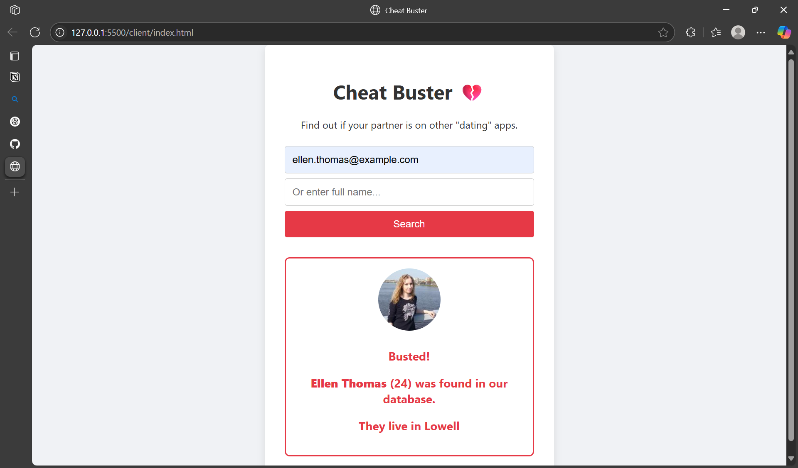
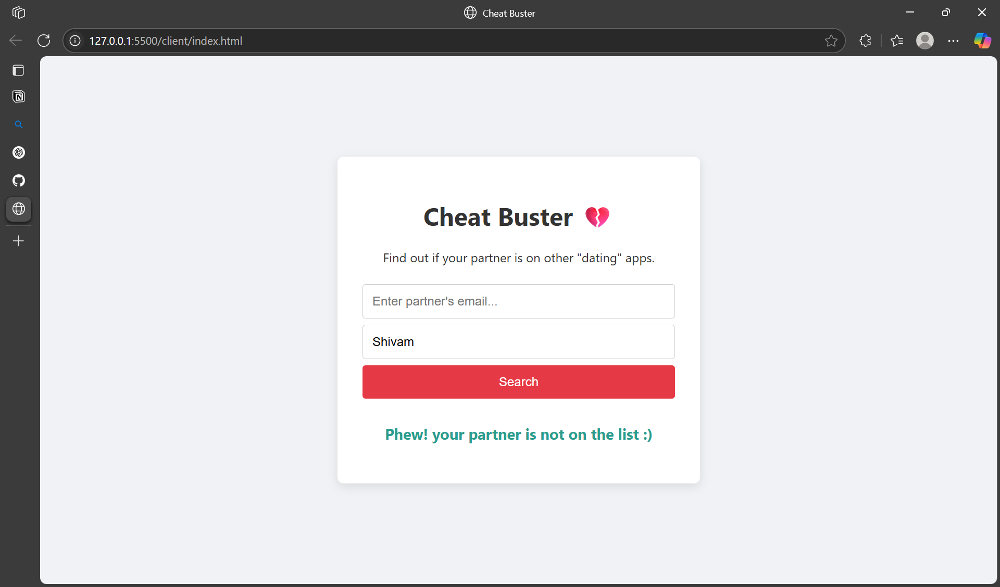
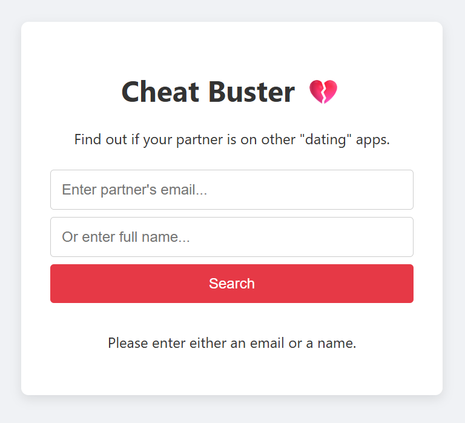

# Cheat Buster

**Find out if your partner is on other "dating" apps.**

---

## Overview

Cheat Buster allows you to search an email address and see if it appears in a database of users scraped from dating platforms.

---

## Application Flow

### 1. Database Seeding

- **Purpose**: Pre-populate the MongoDB database with user data.
- **How**: 
  - On running `server/seed.js`, it connects to the database (`connectDB` in `seed.controller.js`).
  - Fetches 50 random users from `randomuser.me/api`.
  - Stores each as a user in the database with fields: `firstName`, `lastName`, `email`, `age`, `city`, `picture`.

  

### 2. Server Startup

- **Entry Point**: `server/index.js`
- **How**:
  - Loads environment variables and connects to MongoDB.
  - Sets up Express server with JSON & CORS middlewares.
  - Listens for requests on the configured port.
  - Registers all user-related API routes under `/api` (see next step).

  


### 3. Implemented Request Throttling

  


- **Route**: `GET /api/search?email=...`
- **Handler**: `searchUser` (`user.controller.js`)

---

### 4. Search User by Name and Email

  
  


- **Route**: `GET /api/search?email=...`
- **Route**: `GET /api/search?name=...`
- **Handler**: `searchUser` (`user.controller.js`)

---

### 5. If User Does Not Exist 

  

- **Route**: `GET /api/search?name=...`
- **Handler**: `searchUser` (`user.controller.js`)

---

### 6. Error Handler 

  

- **Route**: `GET /api/search`
- **Handler**: `searchUser` (`user.controller.js`)

---

### OpenAPI documentation

- **Route**: `GET /api-docs`
  
  
---

## Directory Structure

```
cheat-buster/
│
├── client/
│   ├── index.html      # Main web page
│   ├── script.js       # Handles API requests and displaying results
│   └── style.css       # Basic styling
│   └── api.js          # Handles all axios logic
│
└── server/
    ├── controllers/
    │   ├── seed.controller.js   # Seeding logic & DB connect
    │   └── user.controller.js   # User search logic
    ├── models/
    │   └── user.model.js        # User schema definition
    ├── routes/
    │   └── user.routes.js       # API routes
    ├── index.js                 # Express server entry point
    └── seed.js                  # Script to seed database
```

---

## Quick Start

1. **Clone the Repository**

    ```bash
    git clone https://github.com/pandeyshivam-debug/cheat-buster.git
    cd cheat-buster
    ```

2. **Install Dependencies**

    ```bash
    cd server
    npm install
    ```

3. **Set Up Environment**

    - Create a `.env` file in the `server` folder:
        ```
        MONGO_URI=your_mongodb_uri
        PORT=3000
        ```

4. **Seed the Database**

    ```bash
    node seed.js
    ```

5. **Start the Backend Server**

    ```bash
    node index.js
    ```

6. **Run the Client**

    - Open `client/index.html` directly in your browser, or serve via a static server.

    - Make sure the backend is running at `http://localhost:3000`.

---

## Example Usage

- Enter an email like `example@email.com` and hit "Search".
- If the email exists in the seeded database, you'll see details and a photo.
- If not, you'll get a reassuring message.

---