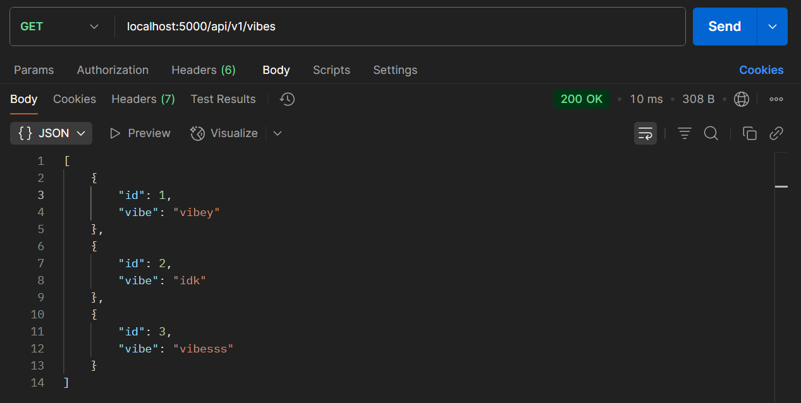

# VIBECHECK API

A simple and professional RESTful API built with Express.js and MongoDB for sharing user-generated "vibes". The API supports authentication, vibe posting, pagination, and personalized feeds using JWT tokens.

---

## Features

- JWT-based authentication (Signup)
- Post a vibe (protected route)
- Get all vibes (with populated user info)
- Get vibe by ID
- Like a vibe
- Pagination support
- Personalized feed based on following
- Authorization middleware
- Postman-tested endpoints

---

##  Application Flow

### 1. **User Signup**  
`POST /api/v1/auth/signup`


---

### 2. **Create a Vibe (Authorized)**  
`POST /api/v1/vibes`

Header:
```
Authorization: Bearer <your_token>
```


---

### 3. **Unauthorized Vibe Creation**  
Trying to post a vibe without a valid token returns:

```json
{
  "message": "Not authorized, no token"
}
```


---

### 4. **Get All Vibes**  
`GET /api/v1/vibes`



---

### 5. **Get Single Vibe by ID**  
`GET /api/v1/vibes/:id`


---

### 6. **Like a Vibe**  


---

### 7. **Get a User's Feed**  


---

### 8. **Pagination Support**  
`GET /api/v1/vibes?limit=2&page=2`


---

### 9. **Personalized Feed**  
`GET /api/v1/feed`

Header:
```
Authorization: Bearer <your_token>
```


---

## Database and Data


---

## Project Structure

```
project/
├── config/
│   ├── db.js
├── controllers/
│   ├── authController.js
├── middleware/
│   ├── auth.js
│   └── error.js
|   └── isOwner.js
├── routes/
│   └── auth.js
│   └── comments.js
│   └── users.js
├── screenshots/
├── utils/
│   └── errorResponse.js
│   └── generateToken.js
├── .gitignore
├── package-lock.json
├── package.json
├── README.md
└── server.js
```

---
